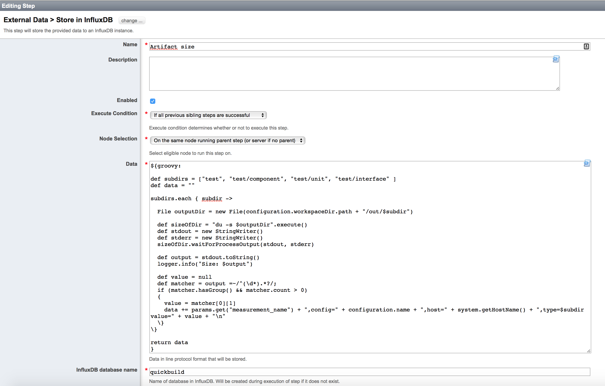
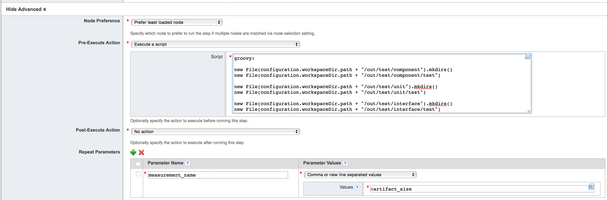

# Quickbuild InfluxDB Plugin
Intention of this plugin is to simplify storing data in InfluxDB using the HTTP API. Having the functionality implemented as a real Quickbuild Plugin and using standard Java functionality to call the HTTP API makes this plugin available on all supported Quickbuild platforms.

# How to work with the plugin?
In order to make modifications and test them on a local Quickbuild instance you have to follow the following steps:

## Prerequisites
* Java SE 1.6
* [Eclipse Galileo(or higher)](http://www.eclipse.org)
* [Quickbuild server binaries](http://www.pmease.com/downloads)

## Setup your work environment
* Create a new workspace directory (eg. quickbuild-dev). Inside this directory you will install the Quickbuild server and checkout the following project.
* Follow instructions from official [Quickbuild documentation](http://wiki.pmease.com/display/QB60/Set+up+Plugin+Development+Workspace) to install Quickbuild and import required Quickbuild projects for plugin development.
* Once you have the four Quickbuild projects (`com.pmease.quickbuild`, `com.pmease.quickbuild.bootstrap`, `com.pmease.quickbuild.equinoxadapter` and `com.pmease.quickbuild.plugin.report.engine`) in your Eclipse imported you have to import the InfluxDB plugin project
* Right-click in 'Package Explorer' and select 'Import...'
* Select 'Existing Projects into Workspace', select path to the root directory of this project and click on 'Finish'
* Now you should see in total five projects (+`com.tt.quickbuild.plugin.influxdb`)
* **In order to load the InfluxDB plugin when starting the local Quickbuild instance via Eclipse we have to create a symbolic link(s) to the quickbuild-plugins repository plugin project(s).**

	```
	user@DE3MCL-507954:~/workspace/git/quickbuild-dev  $ ls -lrt
	quickbuild-6.0.27
	qb-global-storage
	com.pmease.quickbuild
	com.pmease.quickbuild.plugin.report.engine
	com.pmease.quickbuild.equinoxadapter
	com.pmease.quickbuild.bootstrap

	com.tt.quickbuild.plugin.influxdb -> quickbuild-plugins/com.tt.quickbuild.plugin.influxdb

	quickbuild-plugins
    ```
* Now you are ready to start (see the official Quickbuild documentation) the local Quickbuild instance and try the plugin out

# Build project without Eclipse and deploying to Quickbuild production server
In order to build the project without Eclipse you can do that with `ant`

## Prerequisites
* Create `QUICKBUILD_HOME` environment variable. For example:

```
$ export QUICKBUILD_HOME=~/workspace/git/quickbuild-dev/quickbuild-6.0.27/
```

## Building

```
$ cd quickbuild-plugins
$ ant
```
You will find the build plugin jar in the stage/plugins directory.

## Cleaning

```
$ cd quickbuild-plugins
$ ant clean
```

## Deploying to production server
Copy the generated plugin jar file into the plugins directory of the Quickbuild server installation.

```
$ cp stage/plugins/com.tt.quickbuild.plugin.influxdb_0.0.1.jar <location_of_production_server>/plugins/.
```


# How to create a step and store data in InfluxDB?
The following example shows you how to store artifact sizes provided by the `du` command into an InfluxDB database.


